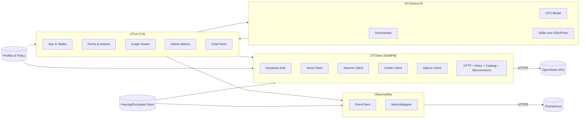
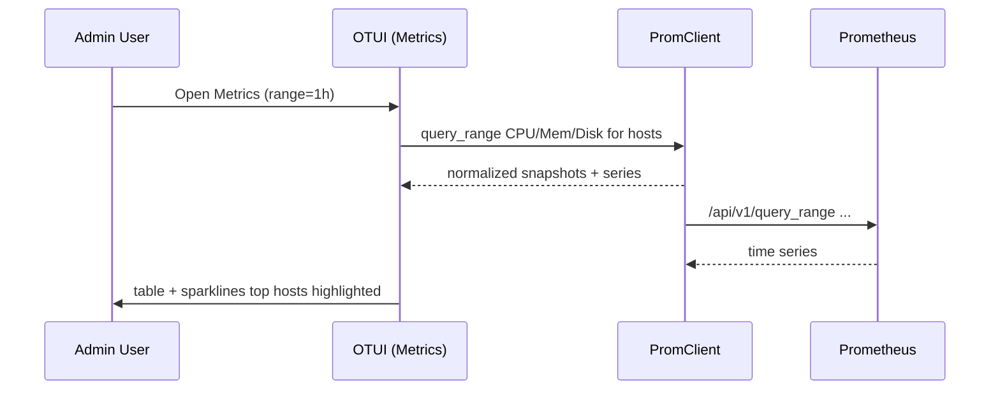
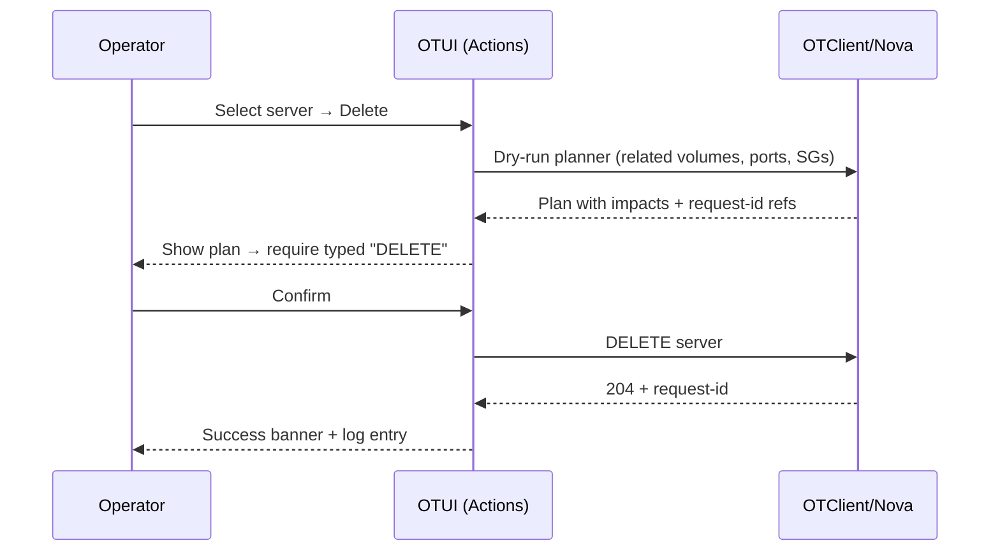
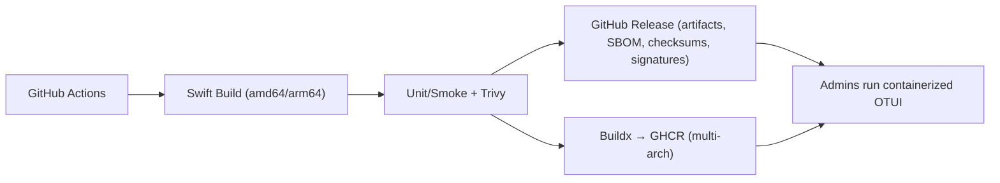
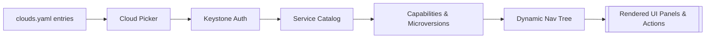

# OTUI — OpenStack Terminal User Interface

**Product Requirements Document (PRD)**
**Repository:** `cloudnull/otui`
**Version:** v1.0 (Foundational)
**Status:** Draft → Pilot-ready

---

## 1) Summary

**What**
OTUI is a Swift-for-Linux **terminal user interface** for operating **OpenStack** across **multiple regions** and **multiple projects**. It’s a fast, keyboard-first control surface with strong safety rails, day-2 workflows, an **ASCII topology graph**, **Admin-only Prometheus metrics**, and an embedded, **CPU-only chat assistant** that grounds answers in live data.

**Why**
Operators, SREs, and Administrators need a single, reliable, low-latency interface that reduces mis-scopes, accelerates incident response, and works over SSH anywhere.

**Outcome**
Faster triage and routine ops, reduced context switching, auditable changes, and a reusable Swift library (`OTClient`) for OpenStack integrations.

---

## 2) Goals / Non-Goals

### Goals

- **Scope awareness:** frictionless **Region ↔ Project** switching with a persistent context banner.
- **Core services (v1):** Keystone v3, Nova v2.1, Neutron v2, Cinder v3, Glance v2.
- **Day-2 operations:** safe CRUD for compute, network, and block storage with **dry-run** previews.
- **Topology view:** **resource graph** per project/region with **ASCII export**.
- **Admin visibility:** **Prometheus** metrics (CPU, memory, storage) for infrastructure nodes.
- **Embedded help:** **on-device chat** (CPU inference) that explains issues and proposes **dry-run plans**.
- **Reusable SDK:** ship `OTClient`, a first-party Swift library for OpenStack APIs.
- **Portable delivery:** single-binary artifacts and minimal container images; signed, SBOM’d releases.

### Non-Goals (v1)

- No desktop GUI.
- No Windows-native build.
- No full parity with every OpenStack extension (Octavia/Heat/Magnum/Swift arrive post-v1).
- Chat **does not** execute mutations; it only proposes plans.

---

## 3) Personas

- **Cloud Operator / SRE** – Triage incidents, need cross-region/project visibility, bulk actions, logs.
- **Platform Engineer** – Manage images, quotas, networks, routine maintenance at scale.
- **Helpdesk / Tier-2** – Read-mostly; quick lookups with guided, safe workflows.
- **Administrators (Admin role / cloud admin)** – Elevated, cross-tenant controls with strong guardrails (hypervisors, quotas, migrations, force ops), evidence, and metrics.

---

## 4) Top Use Cases

1. **Context-safe navigation:** Jump `Cloud → Region → Project → Service` without mis-scoping.
2. **Fleet browsing:** List/filter servers, volumes, ports, routers, FIPs; drill to relations.
3. **Day-2 ops:** resize/rebuild servers; attach/detach volumes; allocate/associate FIPs; manage SG rules.
4. **Quota health:** per project/region view with warnings at thresholds.
5. **Topology at a glance:** render project graph; **export ASCII** for tickets/PRs.
6. **Admin capacity & triage:** see **CPU/Mem/Disk** per host via Prometheus; spot hot nodes.
7. **Explain & recommend:** local chat summarizes failures, risky SGs, capacity headroom; proposes **dry-run** steps.

---

## 5) Scope & Phasing

### v1.0 (MVP, production-viable)

- Auth (Keystone v3): password, token, **application credentials**; optional OIDC device/PKCE where enabled.
- Regions/projects: discover via service catalog; quick-switch & global banner.
- **Read:** Nova (servers/flavors/AZs), Neutron (nets/subnets/ports/routers/FIPs/SGs), Cinder (volumes/snapshots), Glance (images).
- **Write:** core CRUD for servers, volumes, nets/subnets, FIPs, SG rules; image register by URL.
- **Safety:** dry-run previews; typed confirms for destructive ops; clear request-id surfacing.
- **Graphs:** per project/region topology + **ASCII export**.
- **Admin:** hypervisors/aggregates/AZs; service enable/disable; live-migrate/evacuate; force delete/detach; **Prometheus** node metrics (CPU/Mem/Disk).
- **Chat:** local CPU model; read-only tools; **evidence-backed** answers & plans.
- Packaging: static binaries + GHCR images (signed; SBOM).

### v1.1–v1.3 (expansion)

- Services: Octavia, Heat, Magnum, Swift.
- Serial console streaming (read); event stream pane for long ops.
- Admin: quotas update UI; Cinder retype/migrate; Neutron RBAC.
- Graph: collapse/expand groups; Mermaid/DOT export; admin overlays (host/AZ).
- Chat: quick actions → prefilled forms; project scorecards.

---

## 6) Functional Requirements

### 6.1 Authentication & Context

- Keystone v3 flows incl. **application credentials**; optional OIDC device/PKCE.
- Discover catalog/endpoints; maintain **Cloud • Region • Project • User • Role** banner.
- Multiple **profiles**; import `OS_*` env; **ephemeral mode** (no disk writes).

### 6.2 Inventory & Navigation

- Left nav: **Regions → Projects → Services**.
- Center: sortable, paginated tables with `/` search & fuzzy-find; right: details & relations.
- Cross-links: server ↔ volumes ↔ ports ↔ SGs ↔ routers ↔ FIPs.

### 6.3 CRUD (v1)

- **Compute:** create/start/stop/reboot/rebuild/resize; console logs (read).
- **Network:** create nets/subnets; attach/detach ports; FIP lifecycle; SG rule ops.
- **Block:** create/extend/delete volumes; attach/detach; snapshots.
- **Images:** list/register by URL; visibility/sharing per policy.
- **Quotas:** read-only; warn at thresholds (configurable).

### 6.4 Bulk Operations

- Multi-select; **dry-run** plan with per-item outcomes; partial failures surfaced.

### 6.5 **Admin Mode** (role-gated)

- Two-step entry (hotkey + type `ADMIN`) and distinct red banner.
- **Nova:** hypervisors, host aggregates, AZs; service enable/disable; live-migrate/evacuate; reset-state; **force delete**.
- **Neutron:** admin-state toggle; manage shared/RBAC networks (post-v1).
- **Cinder:** **force detach**, reset status; pool view; retype/migrate (post-v1).
- **Quotas:** view/update per project with diff preview & policy checks.
- **Audit:** all admin actions logged with `admin=true` and **request-id**.

### 6.6 **Resource Graph & ASCII Export**

- Nodes: Server, Volume, Port, Network, Subnet, Router, FIP, Security Group.
- Edges: server↔port, port→(network/subnet), router↔subnet/FIP, server↔volume, port↔SG.
- Filters: by type/status/tag/name; hide DHCP/router ports by default.
- Deterministic layout; scrollable canvas; **export ASCII** to file with scope header & totals.

### 6.7 **Admin Metrics via Prometheus** (Admin Mode only)

- Regional Prometheus endpoints; node list snapshots: **CPU %, Mem %, Disk free**.
- Ranges: 15m/1h/6h; ASCII **sparklines** in details.
- Label mapping to match hypervisor hostnames → `instance` label; configurable mountpoint.
- Resilient to timeouts/partial results; clear error states.

### 6.8 **On-Device Chat & Recommendations** (CPU inference)

- Local quantized model (~1–3B) via CPU; **no external calls**.
- Tool-augmented: queries **OTClient** + Prometheus for facts; answers include **evidence** (service, ids, request-ids, timestamps).
- Produces **plan JSON** (read-only) for operator review; opens prefilled forms on accept.

### 6.9 **OpenStack Client Library (`OTClient`)**

- SwiftPM package; Swift 5.9+; Linux amd64/arm64.
- Services: Keystone, Nova, Neutron, Cinder, Glance (v1); microversion negotiation.
- Async/await HTTP; pagination via `AsyncSequence`; retries with backoff on 429/5xx (idempotent).
- Unified `OpenStackError`; surface `x-openstack-request-id`.
- TLS, CA pinning hooks; secrets redaction; structured logs; protocol-first for testing.

---

## 7) Non-Functional Requirements

- **Performance:**
  - List **1,000 servers** in ≤ **2.5s** (healthy control plane).
  - UI interactions post-cache ≤ **150ms**.
  - Graph build ≤ **2s** @ 300 nodes/600 edges.
  - Metrics table first paint ≤ **1.5s** @ 200 nodes.
  - Chat first token ≤ **1.0s**, 2–5 tok/s sustained.
- **Reliability:** retries with backoff; no state corruption on partial failures.
- **Security:** TLS required; warn/deny on insecure endpoints; secrets 0600 at rest or keyring.
- **Accessibility:** high-contrast option; full keyboard nav; no color-only cues.
- **Portability:** single Linux binary; container image **distroless slim** + **debug** variant.

---

## 8) UX & Interaction Model

- **Keybindings (defaults, remappable):**
  - Navigation: `Tab/Shift+Tab`, `↑/↓/PgUp/PgDn`, `/` search, `Enter` details, `:` command palette, `?` help.
  - Context: `g g` global selector; `a` actions; `x` multiselect.
  - **Graph panel:** `g` open, arrows pan, `t` type filter, `c` collapse, `H` admin overlay, `e` export.
  - **Metrics (Admin):** `M` open, `1/2/3` range, `L` live, `R` refresh, `/` search host.
  - **Chat:** `C` open; `Shift+Enter` verbose; evidence on right pane (`Tab` to toggle).
- **Safety:** context mismatch guard; typed “DELETE” confirmations; plan previews with deltas.
- **Context banner:** always visible `Cloud • Region • Project • User • Role`.

---

## 9) Architecture

### 9.1 Component Diagram



### 9.2 Example Sequence — “Admin views hot hosts”



### 9.3 Example Sequence — “Delete server (dry-run)”



---

## 10) API Integration Map (v1)

- **Keystone v3:** auth, catalog, projects, roles, application credentials.
- **Nova v2.1:** servers, flavors, AZs; actions (start/stop/reboot/rebuild/resize); console logs; (admin) live-migrate/evacuate/reset-state/force delete.
- **Neutron v2:** networks, subnets, ports, routers, FIPs, security groups/rules; admin-state.
- **Cinder v3:** volumes, attachments, snapshots; extend; (admin) force detach/reset-status.
- **Glance v2:** images list/detail; create by URL; visibility/share flags.
- **Prometheus:** `/api/v1/query(_range)` with node exporter metrics; optional Ceph metrics post-v1.

---

## 11) Security & Compliance

- **Transport:** Enforce HTTPS; warn/deny on insecure endpoints; optional **cert pinning**.
- **Secrets:** keyring/libsecret preferred; else encrypted files (0600). Redaction middleware for logs.
- **RBAC-aware UI:** discover roles/capabilities; feature-gate uncertain actions.
- **Admin Mode:** two-step entry; policy toggles (e.g., deny force delete outside windows).
- **Evidence:** log **request-ids** and admin flag for all mutations; exportable admin action report (JSONL→CSV).
- **AI privacy:** chat is local-only; no external calls; sensitive values stripped from prompts.

---

## 12) Telemetry & Logging

- **Local action journal:** JSONL with timestamps, scope, action, request-ids, `admin=true` when applicable.
- **Opt-in anonymous metrics:** feature use counts, perf timings, error rates (no resource names/IDs).
- **Graph/Metrics:** record render times, node/edge counts (opt-in).
- **Chat:** record plan hashes & durations (content excluded).

---

## 13) Packaging & Distribution

**Artifacts**

- **Linux binaries**: `otui-linux-amd64`, `otui-linux-arm64`; vendored Swift runtime if needed.
- **Container images (GHCR)**: `ghcr.io/<org>/otui:{version}-slim|debug` (multi-arch).
- **Supply chain:** SHA-256 checksums; SBOM (SPDX); signatures (**Cosign**); vuln scan (Trivy).

**Build & Release (GitHub Actions)**

- Trigger on `v*` tags (release) and `main` (pre-release).
- Matrix build (amd64/arm64); unit & smoke tests; SBOM + vuln scan gates.
- Upload artifacts to GitHub Release; build & push multi-arch images to **GHCR**.

**Runtime**

```bash
# Binary
./otui --profile rackspace-prod

# Container (TTY)
docker run --rm -it \
  -v $HOME/.otui:/home/otui/.otui:ro \
  -e OTUI_PROFILE=rackspace-prod \
  ghcr.io/<org>/otui:latest-slim
```

**Pipeline Diagram**



---

## 14) Metrics / Success Criteria

- **Time-to-action:** Launch → first scoped action in **<30s** (new user).
- **Operator speed:** ≥ **30% faster** to locate & act vs. CLI+Horizon baseline.
- **Adoption:** ≥ **70%** of SREs keep OTUI after 30 days; NPS ≥ **+30**.
- **Graph utility:** ≥ **80%** report faster network/storage diagnosis in pilot.
- **Admin metrics:** time-to-first-metrics ≤ **2s** @ ≤200 nodes.
- **Chat grounding:** ≥ **80%** of chat answers include ≥3 evidence items from live data.

---

## 15) Risks & Mitigations

- **Heterogeneous clouds:** feature gaps & microversions differ → detect capabilities and gate UI.
- **Swift static linking limits:** glibc dependencies → ship vendored runtime + distroless images.
- **Large inventories:** pagination + background refresh; streaming render; saved filters.
- **Chat hallucination:** hard grounding (tools required), evidence blocks, conservative defaults.
- **Prom label mismatch:** provide template/regex mapper + in-UI test tool.

---

## 16) Rollout Plan & Milestones

- **M0 (Weeks 0–2):** skeleton TUI, config loader, Keystone auth, service catalog, region/project switch.
- **M1 (Weeks 3–6):** list views for Nova/Neutron/Cinder/Glance; search/sort; details.
- **M2 (Weeks 7–10):** core CRUD; dry-run; confirmations; action journal.
- **M3 (Weeks 11–12):** graph + ASCII export; admin hypervisor views; packaging (deb/rpm/container).
- **M4 (Weeks 13–14):** Prometheus metrics (Admin); chat MVP (CPU model; read-only tools).
- **Beta:** targeted operator/admin cohort; perf & hardening passes.
- **GA:** docs, signed releases, SBOMs; Octavia read-only preview; plugin API draft.

---

## 17) Acceptance Criteria (samples)

- **Inventory:** Listing **1,000 servers** returns table in **≤2.5s**; switching project/region re-queries and updates banner.
- **Safety:** destructive ops require typed confirmation; UI shows **request-id** on completion; journal records action.
- **Graph:** `g` renders a project graph ≤ **2s** (300 nodes/600 edges); `e` exports ASCII with scope header & totals; collapsing a group updates counts (`+N more`).
- **Admin Metrics:** `M` shows node snapshots (**CPU/Mem/Disk**) for region; details show **sparklines** over selected range; label mapping test is built-in.
- **Admin Ops:** live-migrate from hostA→hostB shows dry-run capacity checks; on confirm, request-id is surfaced; quota update shows diff & policy result.
- **Chat:** “Which hosts in LON were >85% CPU last hour?” returns ranked list with Prometheus evidence within **≤3s** after fetch; “Why did `db-07` fail to attach volume?” cites Nova/Cinder errors with **request-ids** and proposes a safe plan.

---

## 18) Open Questions

- Default embedded model size/quant (1–2B Q4_K vs ~3B Q4_K).
- Ship model file inside release vs **first-run offline** installer (with checksum)?
- Policy packs for PCI/HITRUST guardrails in Admin Mode?
- Default config format: YAML vs TOML (current: **YAML**).

---

## 19) Initial Backlog (Epics → Stories)

- **Auth & Profiles:** Keystone flows; env import; ephemeral mode; OIDC device (if available).
- **Inventory UX:** tables, filters, saved views, multiselect, details.
- **Compute Ops:** create/resize/rebuild; console logs; (admin) live-migrate/evacuate.
- **Network Ops:** nets/subnets/ports; SG rules; FIPs; router attach; admin-state.
- **Block Ops:** volumes extend/snapshot; attach/detach; (admin) force detach.
- **Images:** register by URL; visibility/share.
- **Safety & Evidence:** dry-run planner; request-id surfacing; action journal.
- **Graph:** builder/layout/renderer; filters; ASCII export; collapse groups.
- **Admin Metrics:** Prom client; mapper; node table; details sparklines; error states.
- **Chat (CPU):** engine wrapper; tool schema; grounding + evidence; plan JSON; UI panel.
- **SDK (OTClient):** HTTP core; errors; services (Nova/Neutron/Cinder/Glance); pagination; microversions; DocC; fakes.
- **Packaging:** GitHub Actions for binaries & GHCR; SBOM; signing; Trivy gates.
- **Docs:** man page; admin hardening; usage guides; examples.

---

## 20) Configuration (updated: clouds.yaml-first & dynamic discovery)

### 20.1 Goals

- **Zero bespoke endpoint config:** OTUI discovers **regions, projects, services, and endpoint URLs** from Keystone’s **service catalog**.
- **Standard OpenStack config:** Users define clouds in the standard **`clouds.yaml`** (and optional `secure.yaml`). OTUI consumes these and renders a **dynamic UI** based on what the catalog exposes and what the user’s token authorizes.

### 20.2 Config sources & precedence

1. **Environment**: `OS_CLOUD` (selects a cloud entry), plus standard overrides (`OS_PROJECT_NAME`, etc.).
2. **User clouds**: `~/.config/openstack/clouds.yaml` and `~/.config/openstack/secure.yaml` (if present).
3. **System clouds**: `/etc/openstack/clouds.yaml` and `/etc/openstack/secure.yaml`.
4. **OTUI prefs**: `~/.otui/otui.yml` for **UI preferences only** (theme, keybindings, Prometheus endpoints, interface preference, policy toggles). **No credentials** live here.

> If `OS_CLOUD` is unset, OTUI shows a **cloud picker** populated from all discovered `clouds.yaml` entries.

### 20.3 Discovery workflow (per selected cloud)

1. **Authenticate** via credentials defined in the chosen `clouds.yaml` entry (password, token, or **application credentials**).
2. **Fetch the service catalog** from Keystone (scoped token).
3. **Build dynamic capabilities** by inspecting:
   - **Services present** (e.g., `compute`, `network`, `volumev3`, `image`, `load-balancer`).
   - **Endpoint interfaces** per service: `public`, `internal`, `admin`.
   - **Regions** advertised per endpoint.
   - **Microversion** negotiation results per service (used to gate features).
4. **Enumerate projects** available to the user (domain-aware); use as **project picker**.
5. Populate the **nav tree** (`Cloud → Region → Project → Service`) and enable only those panels/actions that are supported **and** authorized.

### 20.4 Endpoint interface selection

- Per cloud, OTUI chooses the endpoint **interface** using this **preference order** (configurable in `otui.yml`):
  - Default: `admin → internal → public` for admin sessions, `internal → public` for non-admin.
- Per service **overrides** are supported (e.g., use `public` for Glance but `internal` for Nova).
- If an interface is missing for a region/service, OTUI **falls back** to the next preference and annotates the choice in the **status bar** (ⓘ tooltip in help).

```yaml
# ~/.otui/otui.yml (prefs only)
ui:
  theme: high-contrast
  confirm_destructive: true
endpoints:
  interface_preference:
    default: [internal, public]          # non-admin default
    admin:   [admin, internal, public]   # when Admin Mode active
  per_service:
    image: [public, internal]            # example override
```

### 20.5 Multi-environment behavior

- **Every entry** in `clouds.yaml` is surfaced as a **top-level Cloud** in OTUI.
- Within each Cloud, **all regions** in the catalog become selectable.
- **Projects** are pulled from Keystone for the authenticated principal; switching project re-scopes API calls and re-builds the nav tree.

### 20.6 Dynamic UI & feature gating

- If the catalog lacks a service (e.g., Octavia), OTUI **hides** that pane.
- If a service exists but **microversion** or policy doesn’t support an action, the action is **disabled** with an inline reason (e.g., “Policy denies `force_delete`” or “Requires microversion ≥ 2.79”).
- Admin-only panels (hypervisors, quotas, force ops, Prometheus) appear **only** when the token’s roles satisfy the configured **Admin Role** and **Admin Mode** is entered.

### 20.7 Sample `clouds.yaml`

```yaml
# ~/.config/openstack/clouds.yaml
clouds:
  rack-prod:
    region_name: DFW
    interface: internal
    auth:
      auth_url: https://identity.example.com/v3
      username: admin-user
      password: $OS_PASSWORD
      project_name: admin
      user_domain_name: Default
      project_domain_name: Default
  rack-lab:
    auth:
      auth_url: https://keystone.lab.local:5000/v3
    # Prefer application credentials when possible
    application_credential_id:  "abcd1234..."
    application_credential_secret: "$APP_CRED_SECRET"
    interface: public
```

> OTUI respects common `clouds.yaml` fields (`auth_url`, `region_name`, `interface`, `verify`, CA bundle paths, etc.). If **both** `clouds.yaml` and `secure.yaml` exist, OTUI merges them using standard OpenStackClient rules.

### 20.8 Minimal OTUI preferences (non-secret)

```yaml
# ~/.otui/otui.yml
ui:
  theme: high-contrast
  keymap: vi
observability:
  prometheus:
    endpoints:
      DFW: https://prom-dfw.example.com
      LON: https://prom-lon.example.com
    auth:
      type: bearer
      bearer_token_file: ~/.otui/prom.token
    label_mapping:
      instance_template: "${host}:9100"
ai:
  enabled: true
  model:
    path: ~/.otui/models/otui-q4.gguf
    max_tokens: 512
policy:
  admin_role_names: ["admin", "cloud_admin"]
endpoints:
  interface_preference:
    default: [internal, public]
    admin:   [admin, internal, public]
```

### 20.9 Caching & offline behavior

- OTUI caches the **last known good** catalog and per-service microversion probes **per cloud**.
- If Keystone is temporarily unreachable, OTUI can still **render** cached clouds/regions to allow viewing local logs/notes; API actions will surface a **connectivity error** until auth refresh succeeds.

### 20.10 Security notes

- Credentials remain in **`clouds.yaml` / `secure.yaml`** (or environment). OTUI never duplicates them into `otui.yml`.
- When supported, OTUI stores any **session tokens** in memory (ephemeral mode) or uses the OS keyring for refreshable tokens.
- CA verification and custom CA bundles from `clouds.yaml` are honored by `OTClient`.

### 20.11 Acceptance (configuration)

- Given only a valid **`clouds.yaml`**, OTUI lists those clouds in the **cloud picker**, fetches the **catalog**, and renders panels only for present services.
- Switching **regions** modifies endpoints according to **interface preference** and the service catalog, with choices reflected in the status bar.
- A cloud lacking Neutron **hides** network panels; adding Neutron to that cloud (and re-auth) **enables** them without code changes.

#### Catalog-driven UI (illustrative)



---

## 21) Command Palette (examples)

```
:graph filters=hide:dhcp,types=server,volume
:metrics range=6h az=AZ1
:chat "Show orphaned volumes in payments-prod and propose cleanup steps"
```

---

## 22) Licensing & Governance

- **License:** Apache-2.0 (TBD with maintainers).
- **Governance:** Open source under `cloudnull/otui`; PRs require DCO sign-off; semantic versioning; roadmap tracked in GitHub Projects.

---

### Appendix A — `OTClient` Swift usage (informative)

```swift
import OTClient

let client = try await OTClient.connect(
  config: .init(
    authURL: URL(string:"https://identity.example.com/v3")!,
    region: "DFW",
    projectId: "abc123",
    http: .defaults
  ),
  credentials: .applicationCredential(id: "<id>", secret: "<secret>")
)

let nova = client.nova
for try await s in nova.listServers(filter: .init(status: .active)) {
  print("\(s.name) \(s.id)")
}
```
