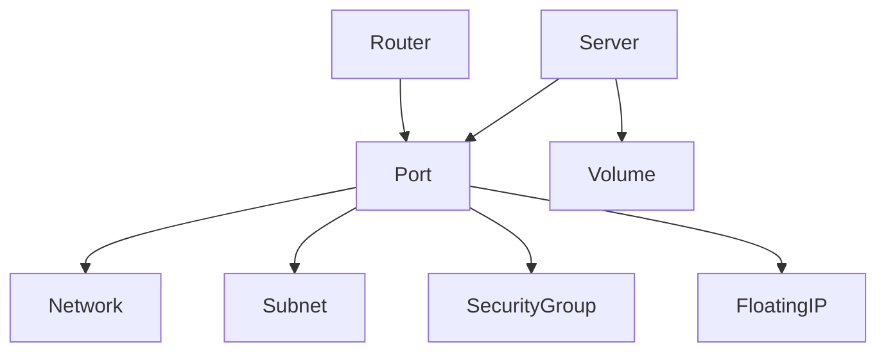

# OTUI

OTUI is an experimental terminal user interface for OpenStack written in Swift. It combines a reusable `OTClient` library with a curses-based TUI reminiscent of K9s, providing real-time visibility into common OpenStack resources and a foundation for full CRUD management.

## Features
- Keystone authentication and service discovery
- CRUD helpers for Nova servers, Neutron networks, Cinder volumes, and Glance images
- Real-time terminal interface built with ncurses
  - `1` Servers, `2` Networks, `3` Volumes, `4` Images, `5` Topology
  - `w` Export topology (Topology tab), `q` Quit
- Cross-platform support for Linux and macOS

## Prerequisites
- Swift 5.8 or later
- `ncurses` development headers (`brew install ncurses` on macOS or `apt-get install libncurses-dev` on Debian/Ubuntu)
- An OpenStack account with API access

## Building
```bash
swift build
```

### Running Tests
```bash
swift test
```

## Running
Export the standard OpenStack environment variables before launching the interface:

```bash
export OS_AUTH_URL=<keystone-auth-url>
export OS_USERNAME=<username>
export OS_PASSWORD=<password>
export OS_PROJECT_NAME=<project>
export OS_REGION_NAME=<region>   # or OS_REGION
export OS_USER_DOMAIN_NAME=Default        # optional
export OS_PROJECT_DOMAIN_NAME=Default     # optional
```

Then start the TUI:

```bash
swift run otui
```

The interface refreshes every 200ms. Use the number keys to switch resources and `q` to quit.

## Topology Graph
The Topology tab (`5`) renders an ASCII map of the current project's deployment. It walks servers and routers to their attached ports, showing each port's network, subnet, security groups, floating IPs, and any volumes mounted to the server. Press `w` while viewing the tab to export the graph and resource totals to `topology.txt`.



## Development
The `OTClient` library can be imported by other Swift packages to build custom automation or tooling against OpenStack.

## License
Distributed under the MIT License. See [LICENSE](LICENSE) for details.
