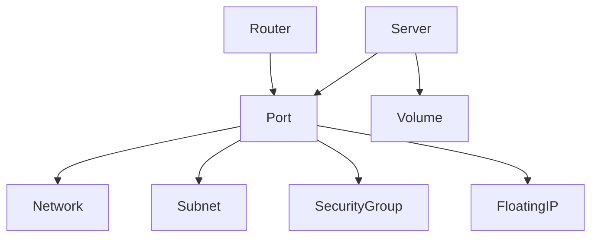

# OTUI

OTUI is an experimental terminal user interface for OpenStack written in Swift. It combines a reusable `OTClient` library with a curses-based TUI reminiscent of K9s, providing real-time visibility into common OpenStack resources and a foundation for full CRUD management.

## Features

- Keystone authentication and service discovery
- CRUD helpers for Nova servers, Neutron networks, Cinder volumes, and Glance images
- Real-time terminal interface built with ncurses
  - Persistent banner showing region and project
  - `1` Servers, `2` Networks, `3` Volumes, `4` Images, `5` Topology
  - `/` Search current view (ESC to clear)
  - `w` Export topology (Topology tab), `q` Quit
- Cross-platform support for Linux and macOS

## Prerequisites

- Swift 6.1 or later
- `ncurses` development headers (`brew install ncurses` on macOS or `apt-get install libncurses-dev` on Debian/Ubuntu)
- An OpenStack account with API access

## Building

```bash
swift build
```

### Running Tests

```bash
swift test
```

## Running

OTUI uses the standard OpenStack `clouds.yaml` configuration file instead of environment variables. Create a `clouds.yaml` file at `~/.config/openstack/clouds.yaml` with your OpenStack cloud configurations:

```yaml
clouds:
  mycloud:
    auth:
      auth_url: https://identity.example.com:5000/v3
      username: admin
      password: secretpassword
      project_name: admin
      user_domain_name: Default
      project_domain_name: Default
    region_name: RegionOne
    interface: public
    identity_api_version: 3
```

Then start the TUI:

```bash
# Use the first/only cloud in your configuration
swift run otui

# Use a specific cloud
swift run otui mycloud

# Use a specific cloud (alternative syntax)
swift run otui --cloud mycloud

# List available clouds
swift run otui --list-clouds

# Use a custom clouds.yaml file location
swift run otui --config ./my-clouds.yaml mycloud
```

### Cloud Configuration Options

OTUI supports both username/password and application credential authentication:

**Username/Password Authentication:**

```yaml
clouds:
  mycloud:
    auth:
      auth_url: https://identity.example.com:5000/v3
      username: myuser
      password: mypassword
      project_name: myproject
      user_domain_name: Default
      project_domain_name: Default
    region_name: RegionOne
```

**Application Credentials:**

```yaml
clouds:
  mycloud:
    auth:
      auth_url: https://identity.example.com:5000/v3
      application_credential_id: abc123def456
      application_credential_secret: super-secret-key
      project_name: myproject
    region_name: RegionOne
```

The interface refreshes every 200ms. Use the number keys to switch resources, `/` to search the current list, `ESC` to clear the search, and `q` to quit.

## Topology Graph

The Topology tab (`5`) renders an ASCII map of the current project's deployment. It walks servers and routers to their attached ports, showing each port's network, subnet, security groups, floating IPs, and any volumes mounted to the server. Press `w` while viewing the tab to export the graph and resource totals to `topology.txt`.



## Development

The `OTClient` library can be imported by other Swift packages to build custom automation or tooling against OpenStack.

## License

Distributed under the MIT License. See [LICENSE](LICENSE) for details.
